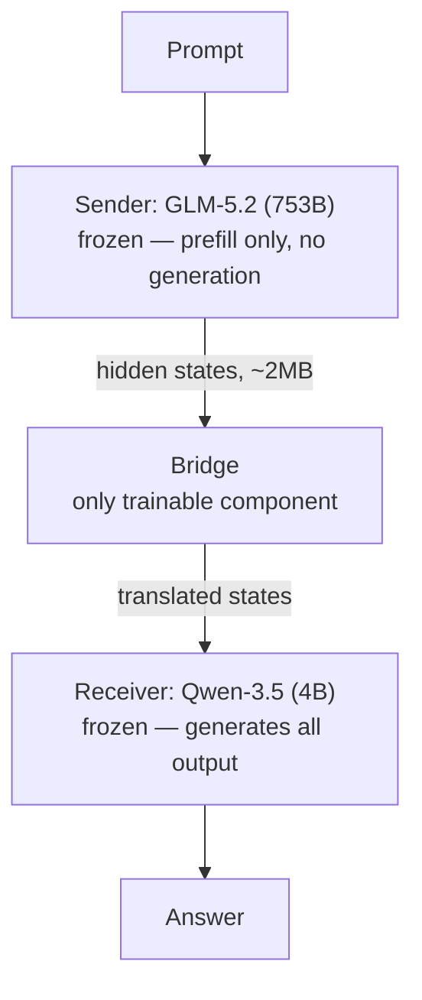
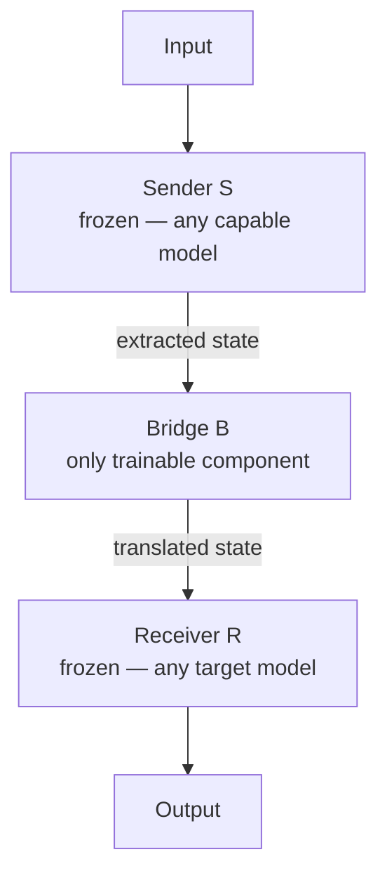

# Mostik: Latent-State Bridges Between Language Models

*Research brief compiled from open-source investigation, 8 September 2026. The underlying story broke 4 September 2026 — four days old at time of writing, so treat anything not independently replicated as a company claim, not an established result.*

## TL;DR

**Mostik**, a Russian AI startup, says it built a trainable "bridge" that lets one language model's internal hidden states flow directly into a second, different model — replacing text as the handoff channel. Chief scientist **Stanislav Smirnov** is the 2010 Fields Medalist (percolation theory, University of Geneva); CEO **Sasha Malysheva** developed the approach. In their flagship demo, a 753B model does only a single reading pass and a 4B model does all the writing, connected by the bridge, closing about half the capability gap between them. All quantitative results are Mostik's own reporting — none of it is independently verified yet, and there's no preprint.

---

## 1. The announcement

- **What**: A method for passing a language model's hidden states — not generated text — into a second, independently-trained model, via a small trained "adapter" module. The company name itself means "little bridge" in Russian.
- **Who**: Founded by CEO **Sasha Malysheva**; chief scientist is **Stanislav Smirnov**, a Russian mathematician, professor at the University of Geneva since 2003, awarded the 2010 Fields Medal for proving conformal invariance of percolation and the planar Ising model (work in complex analysis, dynamical systems, and probability theory).
- **When**: Came out of stealth 4 September 2026. By the company's own account the team is roughly four months old.
- **Team & funding**: 15 people — 12 PhDs plus Smirnov — backed by General Catalyst, Foundation Capital, and other investors (per Mostik's own site).
- **Terminology note**: this is about **LLMs** (large language models), not LMMs (large multimodal models) — both models in the flagship demo are text-only.

## 2. The core method

Mostik's starting argument is an information bottleneck: to produce one output token, a language model builds on the order of a hundred-plus hidden vectors internally — roughly a million numbers, ~2MB of state — then collapses all of it down to one selection from a ~150,000-token vocabulary before discarding the rest. Every standard way of chaining models together (subagents, advisor/executor setups, model councils) runs entirely on that final, heavily-compressed slice.

The "bridge" is a small trained module that maps one model's internal representation into a form a second model can consume directly — no text generated or read in between. Both base models stay completely frozen; **only the bridge is trained**. Mostik frames this as a deliberate scientific control: if a lightweight, separately-trained module suffices, that's evidence some shared structure already existed between the two models' representation spaces, rather than the bridge just doing all the work itself.

Two explicitly stated principles underpin the design:
1. **Information asymmetry** — verbalized text carries far less than what a model's hidden states carry.
2. **Compute asymmetry** — reading a prompt is one parallel forward pass (cheap); generating text is sequential and expensive. Hence: large model reads only, small model writes.

## 3. The flagship experiment

**Setup**: GLM-5.2 (Z.ai, 753B parameters) as sender — processes the prompt in a single forward pass and never generates — paired via the bridge with Qwen-3.5 (Alibaba, 4B parameters) as receiver, which produces all output text.

| Metric | Result | Comparison basis | Source confidence |
|---|---|---|---|
| Accuracy gap closed | ~50% of the gap between small-alone and large-alone | small model vs. large model, no bridge | Mostik's own reporting |
| Relative accuracy lift | ~25% (up to 2x on harder problem subsets) | small model alone | Mostik's own reporting |
| Compute savings | ~2.5x less compute | vs. a hypothetical mid-sized dense model scoring the same | Mostik's own reporting, corroborated in press coverage |
| Advantage over text hand-off | up to 10 percentage points, largest when handoff happens early | standard text-passing at matched compute | Mostik's own reporting, corroborated in press coverage |
| Cost reduction | ~20x cheaper | vs. running GLM-5.2 alone for full generation, evaluation unspecified | **Secondary press only** (Superpower Daily) — not found in Mostik's own materials; likely a different comparison basis than the 2.5x figure above and should be treated as less verified |

### What these numbers actually mean

Three of the four headline metrics — gap closure, relative lift, and compute savings — describe the *same* underlying result from the *same* experiment, just in three different reference frames. Only the fourth (advantage over text hand-off) is a genuinely separate comparison.

- **Gap closure (~50%)**: (bridged score − small-alone score) / (large-alone score − small-alone score). If the small model scores S and the large model scores L, a 50% gap closure means the bridged system lands exactly at the midpoint, S + 0.5×(L−S).
- **Relative lift (~25%, up to 2x on harder subsets)**: (bridged score − small-alone score) / small-alone score — the same bridged result, expressed as a percentage gain over the small model's own baseline instead of relative to the small–large gap. "Up to 2x" is this same metric reaching 100% (a full doubling) on a harder slice of problems — not a different metric.
- *A derivable consequence*: Mostik hasn't published raw accuracy numbers, but the two metrics above only agree with each other for one specific relationship between S and L. Setting 0.5×(L−S) = 0.25×S and solving gives **L = 1.5×S** — i.e., on whatever evaluation produced these two headline numbers, the 753B model's own standalone score is implied to be about 1.5x the 4B model's own standalone score. That's a real, checkable inference from their stated numbers alone, even without the raw scores.
- **Compute savings (~2.5x)**: reframes the same bridged result in iso-quality terms — instead of "how much better than the small model alone," it asks "how large a single dense model would need to be to match this quality, and how does its compute cost compare to what the bridged pair actually spends?" This follows from the compute asymmetry the method is built on: the sender pays for exactly one forward pass, while every expensive, sequential generation step runs on the tiny receiver. A single dense model reaching the same quality has to run *all* its generation steps at whatever larger size that requires — and generation cost, not the one-time reading pass, dominates total compute once outputs get long.
- **Advantage over text hand-off (up to 10 percentage points)**: the one genuinely separate comparison — latent hand-off vs. the standard approach of passing generated text between models, at matched compute. Worth being precise on units: "percentage points" is an *absolute* difference between two accuracy percentages (45% vs. 35% is a 10pp gap), not a relative percentage change. The advantage being "largest when handoff happens early" follows mechanically: a text hand-off's quality depends on how much the large model wrote before switching over, so an early handoff carries very little information; a latent hand-off carries the full prompt-processing state regardless of when the switch happens, so it doesn't degrade the earlier it's moved.
- **For calibration**: the closest published academic analog, Cache-to-Cache (section 6), reports a comparable-shaped result — 3.0–5.0% better performance than text-based communication — in the same ballpark as Mostik's claim, though on a much smaller model pair, and the paper doesn't fully specify whether that figure is percentage points or a relative percentage.

**ARC-AGI-3 claim**: Mostik says a system built with this method landed near the top of the ARC-AGI-3 leaderboard, but has not disclosed the system while the competition is ongoing, and outlets note the result carries a "preview" status that "cannot be considered fully externally verified."

*Context for calibrating that claim*: ARC-AGI-3 (launched by the ARC Prize Foundation in San Francisco, March 2026) is a deliberately brutal benchmark — 135 novel, interactive, turn-based environments with no training overlap. Humans solve them at ~100%; at launch, the best frontier models (Gemini 3.1 Pro, GPT-5.4, Claude Opus 4.6) scored roughly **0.25–0.37%**, with some models at 0%. "Near the top of the leaderboard" on this benchmark is a claim about a very compressed, very low range of scores — worth keeping in mind when weighing how dramatic the claim actually is.

## 4. Interpretability grounding Mostik cites

The company explicitly grounds the "hidden states carry more than text" premise in prior interpretability findings, including:
- Evidence that a model (Qwen-3, per the cited work) represents an upcoming noun before it commits to the article ("a" vs. "an") that has to agree with it — i.e., planning several tokens ahead of output.
- Anthropic interpretability research finding that Claude 3.5 Haiku settles on a target rhyme before writing the line leading to it.
- Related work on limits of chain-of-thought monitoring — the idea that a model's verbalized reasoning doesn't necessarily reflect what it actually computed, which motivates looking at hidden states directly rather than trusting the text trace.

## 5. Reception and immediate context

- **Karl Tuyls** (former Google DeepMind researcher), who reviewed the work, highlighted the practical framing: a large, expensive model used only to read, a small cheap model doing all the writing.
- **Vladimir Arustamyan** (Lovable's technical lead) suggested this could push products toward composing several specialist models rather than leaning on one generalist.
- As of this writing, no independent critical analysis, replication attempt, or academic response specific to Mostik's claims turned up in search — the story is very fresh and largely uncontested so far, which cuts both ways (no rebuttals, but also no confirmation).

## 6. Similar research and practice

This turns out to be a genuinely crowded, active space with its own emerging vocabulary — Mostik's core idea is far from unprecedented, even though its scale (a 753B/4B pairing, both fully frozen, across different model families) is larger than most published academic work in the area.

| Work | Approach | Relation to Mostik | Reported result |
|---|---|---|---|
| **Cache-to-Cache (C2C)** — Fu et al., arXiv:2510.03215, ICLR 2026 | Learned projections fuse one frozen model's KV-cache into another's, bypassing text entirely | Closest direct academic analog: frozen models, trained adapter, applied once at prefill | 8.5–10.5% higher accuracy than either model alone; 3.0–5.0% better than text-based communication; ~2x latency speedup |
| **Latent Cache Flow (LCF)** — Rossi, Raghunath & Wu, arXiv:2605.22863 (2026) | Compresses C2C-style adapters to ~4% of the original size; relaxes the requirement that sender and receiver see identical context | Directly addresses two practical limitations flagged in this brief's own prototype design (adapter cost, context mismatch) | Efficiency gains over C2C at comparable quality |
| **AC — Communicating Activations**, Ye et al., 2025 (ICML 2025) | Sender sends the last-token hidden state from one selected middle layer; receiver combines it with its own via simple addition — training-free | A simpler, training-free cousin: one layer, one fixed operation, instead of a learned bridge module | ~27% accuracy improvement over natural-language communication on reasoning benchmarks |
| **CALM**, Bansal et al., 2024 | Composes two frozen models via cross-attention over intermediate representations | Earlier, more general precursor to the "frozen models + learned connector" pattern | — |
| **"Dead Weights, Live Signals"**, arXiv:2604.08335 (2026) | Several small frozen models feed a shared latent space into larger frozen models via learned projections and a cross-attention output node | Same pattern extended to a graph of multiple frozen models rather than one sender/receiver pair | 17.6M trainable params against ~12B frozen; beat the best single constituent model by up to 11.4 points on ARC-Challenge |
| **n-Musketeers**, arXiv:2602.09173 (2026) | Multiple heterogeneous frozen small models integrated through hidden states via a trainable attention interface, shaped by reinforcement learning | Same latent-integration pattern, applied to multi-expert collaboration rather than one large/small pairing | Competitive with strong single-model RL baselines on reasoning benchmarks |
| **SEMALIGN**, arXiv:2510.24208 (2025) | Layer-attribution plus staged semantic alignment to transfer knowledge across models of different scale | A different mechanism (explicit residual-geometry alignment rather than a black-box trained bridge) aimed at the same cross-scale transfer goal | Reported gains on cross-scale transfer benchmarks |
| **"Beyond Tokens" survey**, Liu, arXiv:2606.05711 (2026) | A formal three-axis taxonomy — WHAT is transmitted, WHICH layers are aligned, HOW it's fused — categorizing 18 methods published 2024–2026 | An academic counterpart to the general framework proposed in section 11 of this brief; worth reading alongside it | Survey paper, no single result |
| **Negative result on Pythia multi-hop transfer**, Zhang, arXiv:2606.03280 (2026) | A linear translation layer between Pythia-160M and Pythia-410M reaches ~0.97 cosine similarity between translated and target activations | An important counterweight: high representational similarity did **not** translate into any downstream answering improvement at this scale | Negative result |

Two things stand out. First, this is a named, actively taxonomized research area, not something Mostik invented from nothing — the "Beyond Tokens" survey above independently arrived at almost the same generalized framing this brief proposes in section 11. Second, the negative result is a useful caution: at least one controlled academic test found that strong representational alignment between two models did not, by itself, guarantee a functional benefit once activations were actually injected — a reminder that Mostik's own headline numbers, however plausible given the surrounding literature, remain unreplicated company claims rather than an established finding.

---

## 7. Research fields and areas this work sits in

| Cluster | Fields / sub-areas |
|---|---|
| **Core technical** | Mechanistic interpretability (hidden-state/residual-stream analysis, activation patching); representational similarity & cross-model alignment (CKA, CCA, Procrustes analysis); model stitching; knowledge distillation (feature-based branch); efficient LLM inference & serving (prefill/decode asymmetry, speculative decoding, cascades, routing) |
| **Directly cited by Mostik** | Interpretability research on models planning ahead of their output; chain-of-thought faithfulness and monitoring limits |
| **Theoretical grounding (added for context, not cited by Mostik)** | Representational convergence theory (Platonic Representation Hypothesis); relative/zero-shot latent-space communication; parameter-efficient transfer learning (adapters, prefix-tuning, LoRA); representation engineering / activation steering |
| **Adjacent systems fields** | Multi-agent LLM orchestration (model councils, subagent architectures); information theory (channel capacity, information bottleneck — Mostik's own "2MB vs. 17 bits" framing) |
| **Motivating / framing fields** | AI safety and scalable oversight (the observability angle); geometry of representation spaces — Mostik's own explicit framing |

## 8. First principles, theories, and assumptions

### Stated directly (by Mostik)
1. Hidden states carry far more information than output text does (the ~2MB vs. ~17-bits-per-token framing).
2. That "extra" information isn't idle capacity — it's grounded in specific evidence that models pre-compute things several tokens before output.
3. Cross-model representational alignment doesn't increase automatically with scale, but some of it exists and "varies in ways we can predict" — treated as a measurable, structured quantity.
4. Freezing both base models is an explicit methodological control: a lightweight bridge succeeding is evidence of pre-existing shared structure, not proof the bridge is doing all the work.
5. The core economic principle — sequential decoding is expensive, parallel reading is cheap — is a systems fact, not a hypothesis, and drives the "large model reads, small model writes" design.

### Inferred — not stated, reasoned from the closest established theory
6. **Representational convergence** as the deepest reason a lightweight bridge should work at all: prior work (the "Platonic Representation Hypothesis," Huh, Cheung, Wang & Isola, 2024, arXiv:2405.07987) argues that neural networks trained with different objectives, on different data and modalities, are converging toward a shared statistical model of reality in their representation spaces. Mostik's own "predictable alignment" language is functionally describing this same phenomenon, though they don't cite it directly in what's public.
7. **Bounded/learnable transformation between spaces**, rather than arbitrary incompatibility: work on relative representations (Moschella et al., ICLR 2023, arXiv:2209.15430) found that distinct latent spaces trained under similar conditions typically differ by an unknown but bounded (quasi-isometric) transformation — this is what would make a *small* trained bridge plausible instead of requiring a full retraining-scale mapping.
8. **Model stitching** is the direct methodological ancestor: connecting the layers of two trained, frozen networks via one simple trainable layer between them is a named technique for probing representational compatibility (originating with Lenc & Vedaldi, 2015; formalized by Bansal, Nakkiran & Barak, NeurIPS 2021, arXiv:2106.07682). Mostik's bridge is this pattern applied across model families for deployment rather than pure analysis.
9. **An unstated layer/position correspondence choice** — GLM-5.2 and Qwen-3.5 differ in depth, width, and tokenizer, so some design decision fixes which sender layer(s) map to which receiver layer(s)/position(s). Not publicly specified.
10. **A sufficiency assumption** — the hidden state at the handoff point has to function as something close to a sufficient statistic for what the large model "figured out," or the receiver gains nothing from it.
11. **A non-interference assumption** — injecting a foreign, learned signal into a frozen model's forward pass adds to its computation without wrecking it. Consistent with representation-engineering findings (Zou et al., 2023) that models encode concepts as roughly linear, context-consistent directions in activation space, which is part of why targeted activation-space edits tend to be tolerated reasonably well.
12. **A generalization assumption**, standard to supervised learning but worth naming explicitly — the bridge must generalize past its training prompts. This matters a lot for how much weight the ARC-AGI-3 claim can bear, since that benchmark specifically punishes pattern-matching over genuine adaptation.
13. **A compute-comparability assumption** baked into their own framing — describing the bridged pair as equivalent to "a mid-sized model" assumes compute cost scales in a roughly comparable way with parameter count across different architecture families, which is a reasonable approximation, not a strict equivalence.

## 9. Reconstructed workflow

*Nothing below is confirmed Mostik internals — this is a plausible reconstruction based on what's disclosed plus how equivalent frozen-model/trainable-adapter systems are standardly built. Treat it as a scaffold for replication attempts, not a leaked spec.*

### Inference-time architecture

### Training-time procedure (reconstructed)
1. Assemble prompts with reference completions or verifiable outcomes (the ARC-AGI-3 use suggests task-correctness signal, not pure imitation).
2. Sender forward pass — frozen, no gradient needed past its hidden states.
3. Bridge forward pass — trainable, transforms sender states into receiver-compatible form.
4. Receiver forward pass under teacher forcing on reference tokens — frozen weights, but a differentiable path is needed so gradients reach the bridge.
5. Backpropagate a next-token loss through the frozen receiver into the bridge parameters only; sender and receiver weights never update.
6. Note: "distillation" is named by Mostik as a *future* direction, not the current method — suggesting the flagship result is closer to direct task-loss optimization of the combined system than classic teacher/student output-matching distillation.

### Design choices and where the risk lives
- **Tokenizer/position mismatch**: sender and receiver don't share a vocabulary, so per-token alignment is nontrivial — a pooled or summarized representation (e.g. last-token state) is more tractable than aligning every position.
- **Layer choice**: given the depth/width mismatch between a 753B and a 4B model, some layer(s) of the sender must be chosen to feed some layer(s) of the receiver.
- **Injection mechanism**: either (a) translated states prepended as extra "soft tokens" to the receiver's sequence (closer to prefix-tuning, generally safer), or (b) direct additive injection into the receiver's residual stream at chosen layers (closer to activation steering, higher risk of destabilizing the receiver's own computation).
- **Stability**: injecting foreign real-valued vectors into a frozen network risks pushing activations out of the distribution its weights were trained on — expect normalization/scaling to match the receiver's own activation statistics, possibly a learned gate controlling injection strength.

### Validating that the bridge is doing real work
A clean, cheap ablation borrowed from a methodologically similar (but unrelated) public project on real-time model coupling: run the trained bridge, then re-run with its output replaced by all-zero vectors, then by norm-matched random vectors. If trained clearly beats random, and random barely beats zero, the *content* of the bridge output is what matters — not just the fact that extra capacity was added. This is a reasonable sanity check to build into any reimplementation attempt.

## 10. A concise prototype design

*A minimal, tractable version of this experiment — small enough to actually run and check whether the mechanism works at all, not a scaled clone of Mostik's 753B/4B pairing. This is a design spec, not code.*

**Model pair**: an open-weight sender in the 7–8B class paired with a receiver in the 0.5–1B class, same model family to start — that isolates whether the effect holds at all before testing whether it survives the harder cross-family case Mostik claims.

**Bridge**: a two-layer MLP with a bottleneck (sender hidden dim → ~256 → receiver hidden dim), plus a learned per-position scalar gate initialized near zero. The near-zero init matters: it makes the receiver behave exactly as it would unmodified at the start of training, so any measured improvement is attributable to what the bridge learns, not to an untrained random perturbation accidentally helping.

**Extraction/injection**: mean-pool the sender's last-layer hidden states over the prompt into one summary vector — this sidesteps the tokenizer-mismatch problem entirely for a first pass — and inject it as 4–8 prefix positions before the receiver's own prompt tokens (soft-token style, the safer of the two injection mechanisms in section 9).

**Data**: a few thousand examples of one verifiable task (e.g. grade-school math word problems, or a factual QA set) with reference answers — small enough to iterate on quickly, unambiguous enough to score cleanly.

**Training**: freeze both models; backprop a standard next-token loss on the receiver's output, teacher-forced on reference answers, through the frozen receiver into the bridge and gate only. A few epochs over the small dataset should be enough to see a signal, if there is one.

**Evaluation, in order**: (1) receiver alone, (2) sender alone, (3) receiver + trained bridge, (4) receiver + zero-vector bridge output, (5) receiver + norm-matched random-vector bridge output. A real result looks like (3) sitting meaningfully above (1) and closer to (2), while clearly beating both (4) and (5) — that's the signal worth scaling up, rather than jumping straight to larger models or cross-family pairs.

## 11. A general framework: the Sender–Bridge–Receiver (SBR) pattern

Stepping back from this specific case, the method generalizes into a reusable pattern with three roles and a small set of configuration choices.

**Configuration axes** — the knobs that define a specific instance of the pattern:

| Axis | Options |
|---|---|
| Extraction point | Which layer(s)/position(s) of S to read |
| Summarization | Per-token vs. pooled (mean, last-token, attention-pooled) |
| Bridge architecture | Linear map → MLP → cross-attention module; gated or not |
| Injection point | Which layer(s)/position(s) of R to write into |
| Injection mechanism | Prefix/soft-token (safer) vs. residual-stream addition (more invasive) |
| Training objective | Direct task loss vs. distillation-style imitation of S vs. a mix |
| Invocation policy | S runs on every input, or only when a router flags the input as hard |

*This maps closely onto an independently-proposed academic taxonomy — see the "Beyond Tokens" survey in section 6 — whose WHAT/WHICH/HOW axes roughly correspond to the extraction/injection-point and injection-mechanism rows above; that survey is a good next read for anyone taking this framework further.*

**Choosing the configuration by goal**:
- **Cost reduction at fixed quality** → prefix-style injection, pooled representation, S invoked once per input.
- **Maximum quality uplift, cost secondary** → per-token (not pooled) extraction, multi-layer injection, a more expressive bridge (cross-attention over all of S's positions rather than one summary vector).
- **Interpretability / observability tool** → prioritize a bridge whose strength can be dialed via the gate, so intervening on the transferred signal and watching R's output change becomes a causal probe of what R is actually using — the goal shifts from performance to legibility.

**When this pattern is likely to help vs. struggle**:
- More likely to help: S and R trained on overlapping domains; both transformer-based; the task rewards depth of world knowledge or reasoning more than raw parameter count in the receiver.
- More likely to struggle: S and R have very different architectures (representational convergence is far less established outside transformers); tasks needing precise multi-step symbolic manipulation, where a single injected "gist" may not substitute for an actual reasoning trace; very long-horizon tasks, where one handoff point may not be enough.

**How this differs from adjacent techniques**:
- **vs. knowledge distillation** — distillation matches output distributions after training; this passes S's live internal state for *this specific input* at inference time, so R is conditioned on S's present computation, not just imitating S's general behavior.
- **vs. retrieval-augmented generation / tool use** — those pass external text or data into a model; this passes internal computed representations between models.
- **vs. mixture-of-experts routing** — MoE routes within a single model's own forward pass; this pattern connects two separately-trained, independent models.

## 12. What's verified vs. not — summary

| Claim | Status |
|---|---|
| Mostik exists, Smirnov is chief scientist, Malysheva is CEO | Confirmed — multiple independent outlets plus company's own site |
| Smirnov's Fields Medal / academic background | Confirmed — independently verifiable biographical record |
| Core architecture description (frozen models, trainable bridge, no text passed) | As described by the company; plausible and consistent with cited literature, not independently audited |
| 50% gap closure / 25% lift / 2.5x compute / 10pp advantage | Company-reported only, not independently replicated |
| ~20x cost reduction | Secondary press claim only, weakest sourcing of the numeric claims |
| ARC-AGI-3 near-top-of-leaderboard result | Explicitly undisclosed and unverified by the company's own admission |
| Peer-reviewed paper or preprint | None found as of this writing |

## 13. Sources and further reading

- Mostik's own announcement: mostik.ai/read-more
- ForkLog English coverage: forklog.com — "Mostik unveils method enabling AI models to share internal states without text"
- Wired (original feature; paywalled, accessed only via secondary citation in this brief)
- Superpower Daily (secondary coverage; source of the ~20x claim)
- Huh, M., Cheung, B., Wang, T., Isola, P. (2024). *The Platonic Representation Hypothesis.* arXiv:2405.07987
- Moschella, L., Maiorca, V., Fumero, M., Norelli, A., Locatello, F., Rodolà, E. (2023). *Relative representations enable zero-shot latent space communication.* ICLR 2023 (oral, top 5%). arXiv:2209.15430
- Bansal, Y., Nakkiran, P., Barak, B. (2021). *Revisiting Model Stitching to Compare Neural Representations.* NeurIPS 2021. arXiv:2106.07682
- Lenc, K., Vedaldi, A. (2015). Original model stitching methodology.
- Zou, A. et al. (2023). Representation engineering / activation steering literature.
- ARC-AGI-3 benchmark: ARC Prize Foundation, launched March 2026.
- Fu, T., Min, Z., Zhang, H., Yan, J., Dai, G., Ouyang, W., Wang, Y. (2025/2026). *Cache-to-Cache: Direct Semantic Communication Between Large Language Models.* ICLR 2026. arXiv:2510.03215
- Rossi, M., Raghunath, P., Wu, E. (2026). *Latent Cache Flow: Model-to-Model Communication Without Text.* arXiv:2605.22863
- Ye et al. (2025). *AC — Communicating Activations.* ICML 2025.
- Bansal et al. (2024). *CALM* (cross-attention composition of frozen models).
- (2026). *Dead Weights, Live Signals: Feedforward Graphs of Frozen Language Models.* arXiv:2604.08335
- (2026). *n-Musketeers: Reinforcement Learning Shapes Collaboration Among Language Models.* arXiv:2602.09173
- (2025). *Beyond Neural Incompatibility: Cross-Scale Knowledge Transfer in Language Models through Latent Semantic Alignment (SEMALIGN).* arXiv:2510.24208
- Liu, Y. (2026). *Beyond Tokens: A Unified Framework for Latent Communication in LLM-Based Multi-Agent Systems* (survey). arXiv:2606.05711
- Zhang, P. (2026). *A Negative Result on Cross-Model Activation Transfer in a Pythia Multi-Hop Setting.* arXiv:2606.03280
